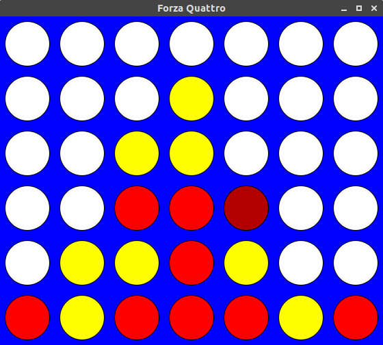

C++ assignment for the ARPRO / PROAV courses at Centrale Nantes.

<p align="center">
  <a></a>
</p>

- **Goal**: implement the game *Four in a Row*
- **Topics**: classes & inheritance
- **Instructions**: have a look at `latex/forza_quattro.pdf`
- **Dependencies**:
  - CMake >= 3.12
  - [piksel](https://github.com/bernhardfritz/piksel)

To compile the solutions:

```
git clone --recursive https://github.com/bernhardfritz/piksel.git
ln -s `pwd`/piksel solution
mkdir solution/build
cd solution/build
cmake ..
make
```

The commands assume that you are in the root folder of the project and that
the repository has just been downloaded.
